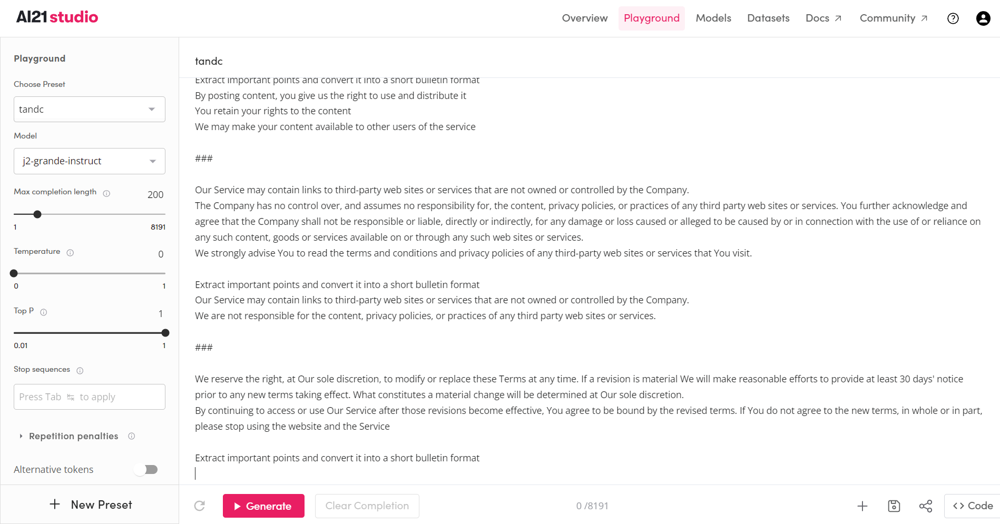
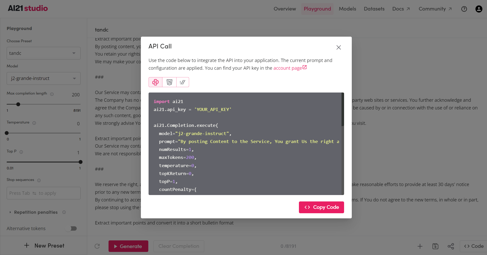
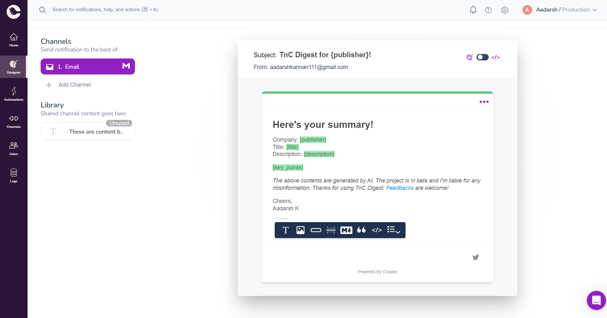
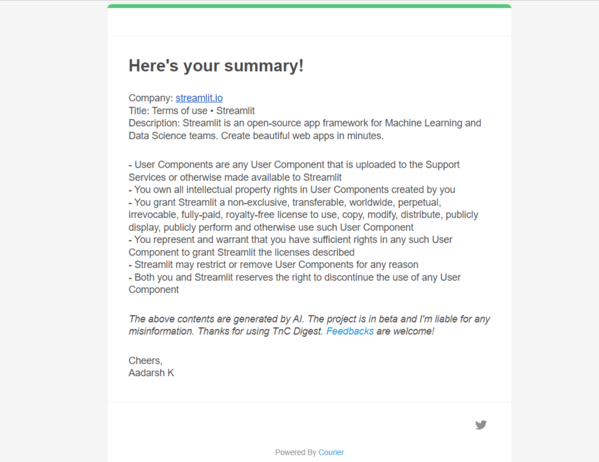

# TnC-Digest
Know what the Terms and Conditions say!

### Inspiration
The inspiration behind TnC Digest was to help people understand lengthy terms and conditions documents, which are often difficult to read and understand. 
To be honest, I have never read a single Terms and Conditions or Policy documents in a my life before signing up any product/service. Have you?

### What it does?
TnC Digest is an app that uses AI to summarize terms, conditions, and policies documents into key points and highlights the most important information for the user and sends the email.

### How I built it
It is build with Python and the AI21 API. I also used Streamlit for the user interface and Courier API to send emails.

#### What is AI21 Labs?

AI21 Labs features include advanced natural language processing, machine learning models for text generation, and AI-based content creation tools for writers and marketers.

**Prompting**

You can train your model and generate own presets at AI21 Labs playground.

Then use the preset code in your code for your desired application.

#### What is Courier?
Courier API allows developers to send personalized, multichannel notifications and messages to their customers through various channels with just a few lines of code.

It provides a easy way of email integration to your app. The designer feature in Courier helps us to create our own templatess easily. We can use these templates in our app by passing the template ID and the desired parameters.

#### What is microlink?
Microlink is an API that extracts information from any link with a single API call, including title, description, author, and more, and supports multiple programming languages.

In our case, I have gathered the publisher, title, and, description from the given website and send these to the Couriers email template API.

### How to run?

- Open in Gitpod or clone the repo.
- Get your API keys 
    
    - [Courier API](https://app.courier.com/signup)
    - [AI21 Labs API](https://studio.ai21.com/sign-up)

- In the .streamlit/secrets.toml file, enter the API keys
- Install the dependancies using the requriements.txt file
- run the command: `streamlit run app.py`

### Output

### Future Scope
I think go to another app is not that good. It is better if we have a **Chrome Extension**. When a user click on the extension it automatically generates key points and also sends those to the respective user to know what they are signing up for.

### References
- [Courier Python client library - Github](https://github.com/trycourier/courier-python)
- [AI21 Labs - Text Segmentation API](https://docs.ai21.com/docs/text-segmentation-api)
- [Microlink API: Overview](https://microlink.io/docs/api/getting-started/overview)

### Contibute
Create an issue/Open a Pull Request. I am open for collaboration and stuff. You can find me on twitter [@dotAadarsh](https://twitter.com/dotAadarsh)
